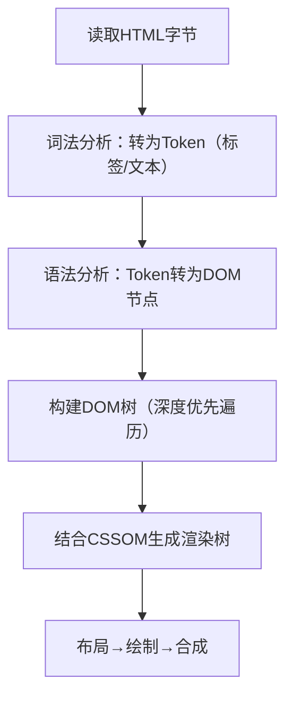

# 面向面试场景的HTML核心知识体系（优化版）
适配快速学习节奏，覆盖「规范代码编写+底层原理讲解」，精准匹配面试「会写+会讲」的双重考察要求。

### 目录
1. [HTML核心模块权重](#一、HTML核心模块权重🟥快速抓重点)
2. [HTML语义化](#二、HTML语义化🟥面试最高频会用+懂价值)
3. [HTML文档结构与核心规范](#三、HTML文档结构与核心规范🟡面试基础懂规范+知原理)
4. [HTML5新特性](#四、HTML5新特性🟥面试核心会用+懂原理)
5. [表单与交互](#五、表单与交互🟡面试高频懂规则+知底层)
6. [HTML性能与兼容性](#六、HTML性能与兼容性🟢面试进阶懂优化+知原理)
7. [HTML面试避坑清单](#附HTML面试避坑清单🟥必考)
8. [复习路径指引](#复习路径指引适配3天冲刺)

---

## 一、HTML核心模块权重（🟥 快速抓重点）
HTML面试核心分值分布（优先掌握前3个，占75%）：
- 🎯 1. HTML语义化 → 最高频（30%）
- 🎯 2. HTML5新特性 → 核心（25%）
- 🎯 3. 文档结构与规范 → 基础（20%）
- 🎯 4. 表单与交互 → 高频（15%）
- 🎯 5. 性能与兼容性 → 进阶（10%）

---

## 二、HTML语义化（🟥 面试最高频：会用+懂价值）
语义化是HTML面试「灵魂考点」，面试官既问「怎么用」，也问「为什么用」，核心是让标签「有含义」，而非纯用`div/span`堆砌。

### 1. 使用层面：语义化标签的实战场景（🟡 面试必手写）
#### （1）核心语义化标签及场景
| 标签                    | 核心场景                         | 替代非语义写法          |
| ----------------------- | -------------------------------- | ----------------------- |
| `<header>`              | 页面/区块的头部（标题/导航）     | `<div class="header">`  |
| `<nav>`                 | 主导航区域                       | `<div class="nav">`     |
| `<main>`                | 页面核心内容（唯一）             | `<div class="main">`    |
| `<article>`             | 独立内容（文章/评论/帖子）       | `<div class="article">` |
| `<section>`             | 文档分区（有标题的区块）         | `<div class="section">` |
| `<aside>`               | 侧边栏（附属内容）               | `<div class="aside">`   |
| `<footer>`              | 页面/区块的底部（版权/联系方式） | `<div class="footer">`  |
| `<h1>-<h6>`             | 标题层级（h1唯一，按层级用）     | `<div class="title">`   |
| `<p>`                   | 段落文本                         | `<div>`                 |
| `<ul>/<ol>`             | 列表（无序列/有序）              | `<div>`                 |
| `<figure>/<figcaption>` | 图片+说明                        | `<div><span>`      |

#### （2）实战：语义化页面结构（🟥 面试必考手写）
```html
<!DOCTYPE html>
<html lang="zh-CN"> <!-- 🚨 面试易错：lang写en/zh（错误），正确为zh-CN -->
<head>
  <meta charset="UTF-8">
  <title>语义化页面示例</title>
</head>
<body>
  <!-- 页面头部 -->
  <header>
    <h1>网站标题</h1> <!-- 🚨 面试易错：一个页面仅能有1个h1，SEO权重最高 -->
    <!-- 主导航 -->
    <nav>
      <ul>
        <li><a href="/">首页</a></li>
        <li><a href="/article">文章</a></li>
        <li><a href="/about">关于</a></li>
      </ul>
    </nav>
  </header>

  <!-- 核心内容：🚨 面试易错：一个页面仅能有1个main，且不能嵌套在header/footer/aside中 -->
  <main>
    <!-- 文章区块 -->
    <article>
      <h2>文章标题</h2>
      <p>文章正文内容... Lorem ipsum dolor sit amet.</p>
      <!-- 图片+说明：🚨 面试易错：img必须加alt属性（SEO/无障碍必备） -->
      <figure>
        
        <figcaption>示例图片说明</figcaption>
      </figure>
    </article>

    <!-- 侧边栏 -->
    <aside>
      <h3>相关推荐</h3>
      <ul>
        <li><a href="#">推荐文章1</a></li>
        <li><a href="#">推荐文章2</a></li>
      </ul>
    </aside>
  </main>

  <!-- 页面底部 -->
  <footer>
    <p>版权所有 © 2026 某某网站</p>
    <p>联系方式：xxx@xxx.com</p>
  </footer>
</body>
</html>
```

### 2. 原理层面：面试官核心追问
#### （1）语义化的底层价值（🟥 必须背会）
- 🎯 对浏览器：帮助理解文档结构，优化渲染（如阅读器模式、语音朗读）；
- 🎯 对SEO：爬虫依赖语义标签解析内容权重（h1/article优先级更高）；
- 🎯 对无障碍：屏幕阅读器能精准识别内容区域（如nav被标为「导航区」）；
- 🎯 对开发：提升代码可读性与维护性（比div.class更直观）。

#### （2）高频追问（🟡 面试必答）
- Q：能用`div`替代所有语义标签吗？  
  A：技术上可以，但失去语义化核心价值（SEO差、无障碍不友好、维护成本高）；语义化是HTML设计初衷，div仅适合无明确语义的通用容器。
- Q：`<main>`标签的特殊点？  
  A：一个页面仅能有1个main，代表核心内容，SEO权重最高，不可嵌套在header/footer/aside中。

### 语义化模块 - 面试速记清单
1. 核心标签：header/nav/main/article/aside/footer（main唯一）；
2. 核心价值：SEO+无障碍+浏览器解析+维护性；
3. 高频坑点：h1重复、main嵌套、img缺失alt。

---

## 三、HTML文档结构与核心规范（🟡 面试基础：懂规范+知原理）
HTML的「地基考点」，聚焦「规范写法」和「底层解析逻辑」，核心掌握`DOCTYPE`、`meta`、文档结构。

### 1. 使用层面：规范文档结构（🟥 面试必写）
```html
<!DOCTYPE html> <!-- 🚨 面试易错：必须写在第一行，否则触发怪异模式 -->
<html lang="zh-CN"> <!-- lang指定语言，SEO/无障碍必备 -->
<head>
  <!-- 1. 字符编码：🚨 必须放在head最前面，避免乱码 -->
  <meta charset="UTF-8">
  <!-- 2. 视口设置：🚨 移动端适配核心，缺一不可 -->
  <meta name="viewport" content="width=device-width, initial-scale=1.0, maximum-scale=1.0, user-scalable=no">
  <!-- 3. SEO基础 -->
  <meta name="keywords" content="HTML,面试,语义化">
  <meta name="description" content="HTML面试核心知识点">
  <!-- 4. 页面标题：🚨 SEO核心，必须有且唯一 -->
  <title>HTML面试核心知识</title>
  <!-- 5. 外部资源：defer避免阻塞DOM解析 -->
  <link rel="stylesheet" href="style.css">
  <script src="script.js" defer></script>
</head>
<body>
  <!-- 页面内容 -->
</body>
</html>
```

### 2. 原理层面：面试官核心追问
#### （1）`<!DOCTYPE html>`的底层作用
- 作用：告诉浏览器用HTML5标准模式解析，而非怪异模式；
- 原理：
  - 怪异模式：模拟旧版IE解析规则（盒模型/布局异常）；
  - 标准模式：遵循W3C规范（标准盒模型、正确布局）；
- 追问：不写DOCTYPE会怎样？答：进入怪异模式，布局出现兼容性问题（如盒模型异常）。

#### （2）`meta viewport`的底层逻辑（🟥 移动端适配核心）
- 移动端视口3类：
  - 布局视口：浏览器默认（如980px），避免页面挤成一团；
  - 视觉视口：用户实际看到的区域（屏幕宽度）；
  - `width=device-width`：让布局视口=视觉视口，适配移动端；
  - `initial-scale=1.0`：初始缩放1，`user-scalable=no`：禁止缩放（避免布局错乱）。

#### （3）HTML解析流程（🟢 面试进阶追问）

- 关键：`<script>`默认阻塞DOM解析（JS可能修改DOM），推荐用`defer`/`async`。

### 文档规范模块 - 面试速记清单
1. DOCTYPE必须写，否则触发怪异模式；
2. meta viewport是移动端适配核心，width=device-width必写；
3. script阻塞解析，优先用defer/async。

---

## 四、HTML5新特性（🟥 面试核心：会用+懂原理）
抓高频考点：新语义标签、新表单、多媒体、核心API，无需记全，聚焦面试常问点。

### 1. 新语义标签（补充原理）
- 底层：为浏览器/爬虫提供明确结构标识，DOM节点nodeName与div不同（如header.nodeName=HEADER），自带默认ARIA角色（如nav的role=navigation）。

### 2. 新表单特性（🟡 面试高频：使用+验证原理）
#### （1）使用层面：新表单控件+原生验证
```html
<form id="userForm">
  <!-- 1. 新input类型：自带验证 -->
  <div>
    <label for="email">邮箱：</label>
    <input type="email" id="email" required placeholder="请输入邮箱">
  </div>
  <div>
    <label for="tel">手机号：</label>
    <!-- 🚨 面试易错：pattern正则需加^$，否则匹配部分内容 -->
    <input type="tel" id="tel" pattern="^1[3-9]\d{9}$" required>
  </div>
  <div>
    <label for="age">年龄：</label>
    <input type="number" id="age" min="18" max="60" required>
  </div>
  <div>
    <label for="birth">生日：</label>
    <input type="date" id="birth">
  </div>
  <button type="submit">提交</button>
</form>

<script>
  // 自定义验证提示（面试进阶）
  const form = document.getElementById('userForm');
  form.addEventListener('submit', (e) => {
    if (!form.checkValidity()) {
      e.preventDefault();
      alert('请填写正确的信息！');
    }
  });
</script>
```

#### （2）原理层面：核心追问
- 新input类型：本质是带内置验证规则的input，浏览器做基础校验（如email格式）；
- `pattern`：基于正则引擎匹配，需加^$限定首尾；
- `required`：标记必填项，提交前检查是否为空；
- 追问：原生验证vs JS验证？答：原生性能高（浏览器底层实现），样式不可定制；JS可定制样式，需手动写规则，性能略低。

### 3. 多媒体（audio/video）- 🟡 面试基础
#### （1）使用层面：核心代码
```html
<!-- 视频播放：🚨 面试易错：autoPlay需配合muted，否则无法自动播放 -->
<video 
  src="demo.mp4" 
  width="400" 
  controls 
  poster="cover.jpg" 
  preload="metadata"
  muted autoplay
>
  您的浏览器不支持视频播放，请升级浏览器！
</video>

<!-- 音频播放 -->
<audio src="demo.mp3" controls loop></audio>
```

#### （2）原理层面：核心规则
- `preload`：none（不预加载）、metadata（仅预加载时长/尺寸）、auto（预加载全部）；
- 自动播放：浏览器限制「静音+用户交互后」才能自动播放（避免扰民）。

### 4. HTML5核心API（🟡 面试进阶：会用+懂原理）
| API            | 使用场景                 | 核心原理                                                     | 面试记忆口诀         |
| -------------- | ------------------------ | ------------------------------------------------------------ | -------------------- |
| localStorage   | 本地永久存储（5MB）      | 存储在浏览器本地，字符串格式，同源策略限制，不参与HTTP请求     | 永久存，5MB，不发请求 |
| sessionStorage | 会话存储（关闭标签清空） | 同localStorage，生命周期为当前会话                           | 会话存，关标签就没   |
| Canvas         | 2D绘图/动画              | 基于像素渲染（位图），通过Canvas API操作上下文绘制，无DOM节点 | 位图渲染，需重绘     |
| FileReader     | 本地文件读取             | 异步读取本地文件内容，基于File API，避免上传前服务器请求      | 异步读，不上传       |

#### （1）使用层面：localStorage/Canvas实战
```javascript
// 1. localStorage使用（🟥 面试必考）
// 🚨 面试易错：存对象需转字符串，取数据需解析
const user = { name: '张三', age: 20 };
localStorage.setItem('user', JSON.stringify(user)); // 存储对象
const savedUser = JSON.parse(localStorage.getItem('user')); // 读取解析
localStorage.removeItem('user'); // 删除
// localStorage.clear(); // 清空

// 2. Canvas绘制（🟢 面试进阶）
const canvas = document.getElementById('myCanvas');
const ctx = canvas.getContext('2d'); // 🚨 核心：获取2D上下文
ctx.fillStyle = '#f00';
ctx.fillRect(10, 10, 100, 100); // 绘制矩形
```

#### （2）原理层面：核心追问
- localStorage vs Cookie：
  | 特性     | localStorage | Cookie                 | 面试记忆口诀         |
  | -------- | ------------ | ---------------------- | -------------------- |
  | 存储大小 | 5MB          | 4KB                    | 本地大，Cookie小     |
  | 生命周期 | 永久         | 可设置过期时间         | 本地永久，Cookie可控 |
  | 传输     | 不参与HTTP   | 随每个请求发送到服务器 | 本地不发，Cookie必发 |
  | 同源策略 | 遵循         | 遵循                   | 都遵循，不同源用不了 |
- Canvas原理：位图渲染（绘制后需重绘），区别于SVG（矢量图，可修改DOM）；
- 追问：localStorage存对象怎么办？答：JSON.stringify转字符串，JSON.parse解析。

### HTML5新特性模块 - 面试速记清单
1. 表单核心：新input类型+pattern+required，原生验证性能高；
2. 存储核心：localStorage存对象需序列化，区别Cookie（大小/传输）；
3. 多媒体：自动播放需静音+用户交互。

---

## 五、表单与交互（🟡 面试高频：懂规则+知底层）
### 1. 核心规则（使用层面）
```html
<!-- 1. label关联（🟥 面试必考：提升无障碍） -->
<!-- 方式1：包裹式 -->
<label>
  用户名：<input type="text" name="username">
</label>
<!-- 方式2：for+id（推荐）：🚨 面试易错：for值需等于input的id -->
<label for="password">密码：</label>
<input type="password" id="password" name="password">

<!-- 2. button类型（🟥 面试必考坑点） -->
<!-- 🚨 易错：不加type默认是submit，会触发表单提交 -->
<button type="button">普通按钮（无默认行为）</button>
<button type="submit">提交按钮（触发表单提交）</button>
<button type="reset">重置按钮（重置表单）</button>
```

### 2. 原理层面：核心追问
- `label`：点击时关联input获焦点（浏览器焦点映射），提升无障碍访问；
- `button`默认类型：type=submit，易触发意外提交，需显式指定type=button；
- 表单提交：数据转为key=value，通过GET/POST发送到action地址，编码格式为application/x-www-form-urlencoded。

### 表单交互模块 - 面试速记清单
1. label关联用for+id，提升无障碍；
2. button必须指定type，避免默认submit触发提交；
3. 表单提交默认编码为x-www-form-urlencoded。

---

## 六、HTML性能与兼容性（🟢 面试进阶：懂优化+知原理）
### 1. 性能优化（🟡 面试高频：懒加载/预加载）
#### （1）使用层面：图片懒加载（🟥 面试必考）
```html
<!-- 原生懒加载（HTML5新增，简单高效） -->


<!-- JS实现懒加载（🟢 面试进阶，手写核心逻辑） -->

<script>
  const lazyImages = document.querySelectorAll('.lazy');
  // 🚨 面试易错：IntersectionObserver比scroll事件性能高（异步不阻塞）
  const observer = new IntersectionObserver((entries) => {
    entries.forEach(entry => {
      if (entry.isIntersecting) {
        const img = entry.target;
        img.src = img.dataset.src;
        observer.unobserve(img); // 停止监听，避免重复触发
      }
    });
  });
  lazyImages.forEach(img => observer.observe(img));
</script>
```

#### （2）原理层面：核心追问
- 原生`loading="lazy"`：浏览器底层实现，图片进入视口前不加载；
- IntersectionObserver：异步监听元素是否进入视口，性能优于scroll（scroll频繁触发重排）；
- 追问：`script`的`defer`和`async`区别？（🟥 必考）
  | 特性     | defer                  | async                  | 面试记忆口诀         |
  | -------- | ---------------------- | ---------------------- | -------------------- |
  | 加载时机 | 异步加载（不阻塞解析） | 异步加载（不阻塞解析） | 都异步，不阻塞       |
  | 执行时机 | DOM解析完成后执行      | 加载完成后立即执行     | defer等解析，async等加载 |
  | 执行顺序 | 按引入顺序执行         | 不保证顺序             | defer保顺序，async不保 |

### 2. 兼容性（🟡 面试基础）
- 核心：HTML5特性降级处理（如video内写降级提示）、DOCTYPE触发标准模式；
- 语义标签兼容：IE8-不支持，需用JS创建（document.createElement('header')）并设置display:block。

### 性能兼容模块 - 面试速记清单
1. 懒加载：原生loading=lazy或IntersectionObserver实现；
2. script优化：defer（保顺序）、async（不保顺序）；
3. HTML5兼容：语义标签需JS创建+display:block（IE8-）。

---

## 附：HTML面试避坑清单（🟥 必考）
1. button默认type=submit，未指定type会触发表单提交；
2. 不写DOCTYPE触发怪异模式，盒模型/布局异常；
3. img缺失alt属性（SEO/无障碍必扣分项）；
4. meta viewport缺失width=device-width，移动端适配失效；
5. localStorage存对象未用JSON.stringify，读取时解析失败；
6. pattern正则未加^$，导致部分匹配（如手机号匹配123也能过）；
7. a标签href="#"点击触发页面滚动，需用href="javascript:void(0)"；
8. h1标签一个页面写多个，降低SEO核心权重；
9. main标签嵌套在header/footer中，违反语义化规则；
10. video自动播放未加muted，导致自动播放失效。

---

## 复习路径指引（适配3天冲刺）
### 第1天：掌握「使用层面」（手写代码）
- 手写语义化页面结构（header/nav/main/article/aside/footer）；
- 手写规范文档结构（DOCTYPE+meta charset+viewport）；
- 手写表单核心代码（label关联+button type+新input验证）；
- 手写localStorage存对象、Canvas基础绘制。

### 第2天：理解「原理层面」（背追问模板）
- 语义化核心价值（SEO+无障碍+浏览器+维护性）；
- DOCTYPE/viewport底层逻辑；
- localStorage vs Cookie、script defer/async区别；
- 懒加载/表单验证底层原理。

### 第3天：冲刺「避坑+真题」（模拟面试）
- 背诵避坑清单，逐一核对代码是否踩坑；
- 模拟手写真题（语义化页面、表单验证、懒加载）；
- 口述核心考点（每个模块速记清单），适配面试口述回答。

---

### 最终总结
HTML面试核心聚焦「语义化+HTML5新特性+文档规范」（占80%分值），原理层面重点掌握「解析流程、存储区别、script加载、懒加载实现」。学习优先级：先手写高频代码，再理解底层原理，最后背诵避坑清单，可快速适配面试「会写+会讲」的核心要求。
[HTML 面试](./html.md)
