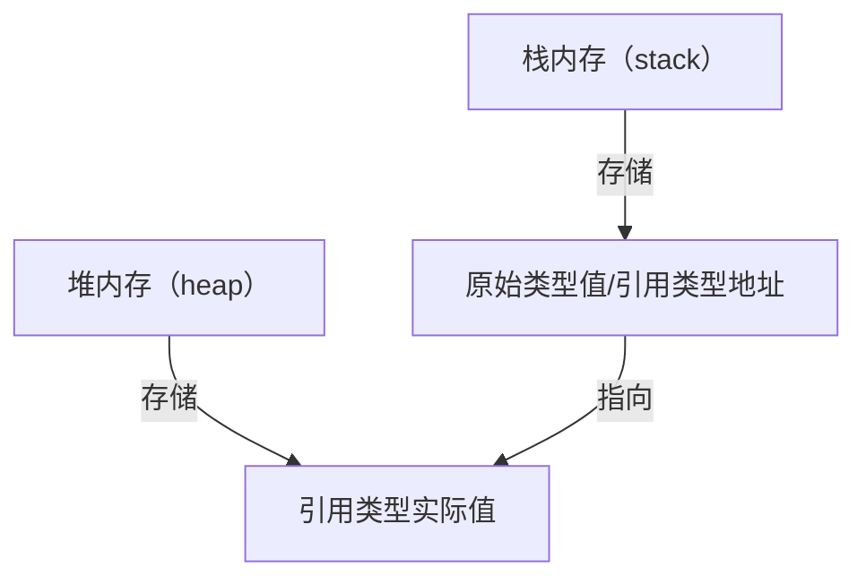

# JS基础.md（面试+全面学习导向版）
## 前言
本文以**前端面试高频考点**为核心，同时兼顾前端开发者日常工作与系统学习需求，覆盖JavaScript基础语法、执行机制、面向对象、异步编程、性能优化、JS相关SEO技巧等核心知识点，不仅讲解「如何用」，更剖析「底层原理」，标注面试权重、易错点、追问方向，既助力面试通关，也支撑前端知识的整体全面学习与落地应用。

## 一、文档核心目的
### 1. 面试通关
聚焦前端面试JS模块高频考点，通过「权重标注+易错点提醒+追问梳理+手写实战」，精准攻克面试核心问题，适配校招、社招等不同场景的面试考核要求。
### 2. 全面学习
覆盖JS从基础语法到高级特性、性能优化、SEO适配的完整知识体系，兼顾原理理解与实战应用，适配前端初学者系统入门、在职开发者查漏补缺的学习需求，夯实JS底层基础。
### 3. 落地应用
结合实际业务场景（如数组处理、异步请求优化、DOM性能优化、SEO适配等），提供可直接复用的代码示例，助力将知识点转化为实际开发能力。

## 二、完整学习大纲
| 模块分类               | 核心知识点                                                                 | 学习目标                                                                 | 面试重点⭐                                                                 |
|------------------------|--------------------------------------------------------------------------|--------------------------------------------------------------------------|--------------------------------------------------------------------------|
| 基础语法与数据类型     | 原始/引用类型、栈堆存储、Symbol/BigInt、隐式转换、浅/深拷贝               | 掌握类型特性与内存机制，能正确实现深拷贝、规避类型相关坑点               | ⭐深拷贝手写（处理循环引用/原型链）、⭐ToPrimitive隐式转换规则、⭐NaN精准判断 |
| 执行机制与作用域       | 执行上下文、this指向、闭包、事件循环、垃圾回收                           | 理解JS运行机制，能分析代码执行顺序，规避内存泄漏                         | ⭐事件循环执行顺序（微/宏任务）、⭐闭包应用+内存优化、⭐垃圾回收算法+泄漏场景 |
| 数组高频API            | map/filter/reduce/forEach区别、手写reduce                                | 熟练使用数组API，能自定义实现核心方法，理解性能差异                     | ⭐reduce手写、⭐forEach与for循环性能对比、⭐reduce实现map/filter             |
| 面向对象与原型         | 原型链、继承方式、class语法、Set/Map/WeakMap/WeakSet                      | 掌握面向对象核心逻辑，能实现最优继承，合理选择数据结构                   | ⭐寄生组合继承、⭐instanceof原理手写、⭐Map/Object性能对比                 |
| 异步编程               | Promise核心/扩展方法、async-await、异步请求优化                           | 掌握异步编程范式，能手写Promise、优化异步请求性能                       | ⭐Promise手写（状态不可逆+链式调用）、⭐async-await并行优化、⭐Promise.all/any区别 |
| ES6+新特性             | 可选链、空值合并、模块化（ES6 vs CommonJS）                              | 掌握高频新特性，理解模块化差异，提升开发效率                             | ⭐可选链/空值合并使用场景、⭐ES6模块化与CommonJS核心区别                   |
| DOM/BOM                | 重排/重绘优化、前端路由（hash/history）                                  | 理解DOM操作性能优化逻辑，掌握前端路由底层原理                           | ⭐重排/重绘优化手段、⭐hash/history路由实现区别                           |
| JS性能优化     | 代码层/加载层/运行层优化、内存优化、异步优化、大数据处理优化              | 掌握全维度JS性能优化手段，能落地前端性能调优                           | ⭐高频事件优化（防抖节流）、⭐异步请求并行、⭐Web Worker使用场景           |
| 前端SEO（JS相关） | JS阻塞渲染优化、SSR/CSR对SEO的影响、爬虫适配、动态内容SEO                | 理解JS代码对SEO的影响，能落地JS层面的SEO优化                           | ⭐defer/async使用场景、⭐SSR/SSG适配、⭐动态内容爬虫解析优化               |
| 手写编程题（核心）     | apply/bind、防抖节流、深拷贝、Promise、reduce                            | 掌握面试必考手写题，处理边界场景，体现编码能力                           | ⭐防抖节流（立即执行+取消）、⭐apply/bind手写、⭐深拷贝完整版实现           |

## 三、核心知识点详解
### 一、基础语法与数据类型（面试权重：★★★★）
#### 1.1 数据类型分类
JavaScript数据类型分为**原始类型**（7种）和**引用类型**（Object/Array/Function等）：
- 原始类型：String、Number、Boolean、Undefined、Null、Symbol、BigInt
- 引用类型：Object（包含Array、Function、RegExp、Date等）

##### 栈/堆存储机制


#### 1.2 高频原始类型补充
##### Symbol（唯一标识）
⚠️ 面试易错点：Symbol值唯一，即使描述相同；`Symbol.for()` 会复用全局注册表中的Symbol。
```javascript
// 实战场景：对象唯一属性名（避免属性覆盖）
const id = Symbol('id');
const obj = { [id]: 123, [Symbol('id')]: 456 };
console.log(obj[id]); // 123（唯一不冲突）

// 面试考点：Symbol.for（全局注册表）
const s1 = Symbol.for('foo');
const s2 = Symbol.for('foo');
console.log(s1 === s2); // true（全局复用）
console.log(Symbol.keyFor(s1)); // 'foo'（获取全局Symbol的key）
```

##### BigInt（超大整数）
⚠️ 面试易错点：BigInt不能与Number直接混合运算，需统一类型。
```javascript
// 实战场景：处理超过Number.MAX_SAFE_INTEGER的数值
const bigNum = 9007199254740993n;
console.log(bigNum + 1n); // 9007199254740994n（正确）
// console.log(bigNum + 1); // 报错：Cannot mix BigInt and other types

// 类型转换
console.log(Number(bigNum)); // 9007199254740992（精度丢失，需注意）
```

##### NaN（非数字）
⚠️ 面试易错点⭐：`NaN !== NaN`，需用`Number.isNaN()`精准判断。
```javascript
// 面试考点：正确判断NaN
console.log(isNaN('123')); // false（隐式转数字123）
console.log(Number.isNaN('123')); // false（仅判断类型+值）
console.log(Number.isNaN(NaN)); // true（精准判断）
console.log(NaN === NaN); // false（核心特性）
```

#### 1.3 变量声明对比（var/let/const）
| 对比维度       | var                | let                 | const               |
|----------------|--------------------|---------------------|---------------------|
| 块级作用域     | ❌                 | ✅                  | ✅                  |
| 暂时性死区     | ❌                 | ✅                  | ✅                  |
| 变量提升       | ✅（提升后undefined） | ❌                  | ❌                  |
| 重复声明       | ✅                 | ❌                  | ❌                  |
| 赋值规则       | 可重复赋值         | 可重复赋值          | 不可修改引用（常量）|

⚠️ 面试易错点：let/const不存在变量提升，暂时性死区是高频追问点。

#### 1.4 隐式转换核心：ToPrimitive规则
面试高频追问⭐：对象转原始值的底层流程（`valueOf()` → `toString()`）。
```javascript
// ToPrimitive底层规则：先调用valueOf，再调用toString
const obj = {
  valueOf: () => 10,
  toString: () => '20'
};
console.log(obj + 5); // 15（优先取valueOf的结果）

// 若valueOf返回非原始值，则调用toString
const obj2 = {
  valueOf: () => ({}),
  toString: () => '20'
};
console.log(obj2 + 5); // '205'（toString返回字符串，拼接）
```

#### 1.5 浅拷贝/深拷贝（面试权重：★★★★★）
##### 核心定义
| 类型     | 本质                                                                 | 影响                     |
|----------|----------------------------------------------------------------------|--------------------------|
| 浅拷贝   | 仅复制引用类型的**栈内存地址**，不复制堆内存中的实际值                 | 新旧对象共享同一块堆内存，修改其一相互影响 |
| 深拷贝   | 递归复制引用类型的**堆内存实际值**，生成全新的引用地址                 | 新旧对象完全独立，修改互不影响           |

##### 浅拷贝实现方式（面试高频）
```javascript
// 方式1：Object.assign（仅拷贝一层）
const obj1 = { a: 1, b: { c: 2 } };
const obj2 = Object.assign({}, obj1);
obj2.b.c = 3;
console.log(obj1.b.c); // 3（深层属性仍共享，验证浅拷贝）

// 方式2：扩展运算符 ...
const obj3 = { ...obj1 };
obj3.b.c = 4;
console.log(obj1.b.c); // 4（同理，仅浅层拷贝）

// 方式3：Array.prototype.slice/concat（数组浅拷贝）
const arr1 = [1, [2, 3]];
const arr2 = arr1.slice();
arr2[1][0] = 4;
console.log(arr1[1][0]); // 4
```

##### 深拷贝实现（面试必考手写⭐）
###### 基础版（JSON.parse + JSON.stringify，有局限性）
```javascript
// 优点：简单易用；缺点：无法拷贝函数、Symbol、循环引用、原型链
const obj4 = { a: 1, b: { c: 2 }, fn: () => {}, s: Symbol('s') };
const obj5 = JSON.parse(JSON.stringify(obj4));
console.log(obj5.fn); // undefined（丢失函数）
console.log(obj5.s); // undefined（丢失Symbol）
```

###### 完整版（手写递归深拷贝，处理边界场景）
```javascript
function deepClone(target, map = new WeakMap()) {
  // 1. 处理原始类型 + null
  if (typeof target !== 'object' || target === null) {
    return target;
  }

  // 2. 处理循环引用（如 obj.self = obj）
  if (map.has(target)) {
    return map.get(target);
  }

  // 3. 处理日期/正则
  if (target instanceof Date) return new Date(target);
  if (target instanceof RegExp) return new RegExp(target);

  // 4. 处理数组/对象（保留原型链）
  const cloneObj = Array.isArray(target) ? [] : Object.create(Object.getPrototypeOf(target));
  map.set(target, cloneObj); // 缓存已拷贝对象，解决循环引用

  // 5. 递归拷贝属性（包含Symbol属性）
  Reflect.ownKeys(target).forEach(key => {
    cloneObj[key] = deepClone(target[key], map);
  });

  return cloneObj;
}

// 测试
const obj6 = { a: 1, b: { c: 2 }, s: Symbol('s'), fn: () => {} };
obj6.self = obj6; // 循环引用
const obj7 = deepClone(obj6);
obj7.b.c = 3;
console.log(obj6.b.c); // 2（深拷贝独立）
console.log(obj7.s); // Symbol(s)（保留Symbol）
console.log(obj7.fn); // [Function: fn]（保留函数）
console.log(obj7.self === obj7); // true（解决循环引用）
```

##### 面试高频考点&易错点
- ❌ 易错点1：认为`Object.assign`是深拷贝（仅浅层拷贝，深层仍共享）；
- ❌ 易错点2：手写深拷贝时忽略循环引用（会导致栈溢出）；
- 📌 追问1⭐：深拷贝如何处理原型链？（答案：用`Object.create(Object.getPrototypeOf(target))`继承原型）；
- 📌 追问2⭐：`JSON.parse(JSON.stringify)`的局限性？（答案：丢失函数/Symbol/循环引用/原型链，无法拷贝RegExp/Date的特殊属性）；
- 📌 追问3⭐：为什么用`WeakMap`缓存循环引用？（答案：WeakMap的键是弱引用，不影响垃圾回收，避免内存泄漏）。

#### 1.6 模块小结
- 原始类型存储在栈中，引用类型地址存在栈、值存在堆；
- Symbol保证属性唯一，BigInt处理超大数，`Number.isNaN()` 精准判断NaN；
- ToPrimitive是隐式转换的核心，对象转原始值优先调用`valueOf()`；
- 浅拷贝仅复制引用地址，深拷贝递归复制堆内存值，需处理循环引用、原型链等边界场景。

#### 1.7 面试连环追问
- Q⭐：null属于原始类型，但`typeof null === 'object'` 为什么？
- A：JS底层用二进制标识类型，null的二进制全为0，而对象的标识位是000，因此误判；
- Q⭐：const声明的对象可以修改属性吗？
- A：可以，const仅限制「引用地址不可变」，对象内部属性可修改；
- Q⭐：深拷贝中WeakMap相比Map的优势？
- A：WeakMap的键是弱引用，被引用的对象可被垃圾回收，避免内存泄漏；Map的键是强引用，会一直占用内存。

### 二、执行机制与作用域（面试权重：★★★★★）
#### 2.1 执行上下文与this指向
##### 严格模式对this的影响
```javascript
// 严格模式：普通函数this指向undefined
'use strict';
function fn() { console.log(this); }
fn(); // undefined（非严格模式是window）

// 非严格模式
function fn2() { console.log(this); }
fn2(); // window
```

#### 2.2 闭包（核心考点⭐：应用场景+内存优化）
##### 定义
函数嵌套函数，内部函数引用外部函数的变量/参数，形成闭包（延长变量生命周期）。

##### 实战场景
1. 柯里化：参数复用
```javascript
function add(x) {
  return function(y) {
    return x + y;
  };
}
const add5 = add(5);
console.log(add5(3)); // 8（复用参数5）
```
2. 模块化：IIFE+闭包实现早期模块化
```javascript
const module = (function() {
  let privateVar = '私有变量';
  return {
    getVar: () => privateVar,
    setVar: (val) => { privateVar = val; }
  };
})();
console.log(module.getVar()); // 私有变量
```

##### 内存泄漏优化
⚠️ 面试易错点：不合理的闭包（长期持有DOM/定时器引用）导致内存泄漏，合理使用不会泄漏。
```javascript
// 闭包优化：避免内存泄漏（及时解除引用）
function createTimer() {
  const timer = setInterval(() => {
    console.log('定时器运行中');
  }, 1000);
  // 返回取消函数
  return () => {
    clearInterval(timer);
  };
}
const cancelTimer = createTimer();
// 组件卸载/不再使用时，清空闭包引用
cancelTimer();
```

#### 2.3 事件循环（Event Loop）
##### 微/宏任务列表（标注优先级）
| 任务类型 | 包含API                                                                 | 优先级 |
|----------|-------------------------------------------------------------------------|--------|
| 微任务   | Promise.then/catch/finally、async-await、queueMicrotask、MutationObserver | 高     |
| 宏任务   | setTimeout/setInterval、DOM事件、AJAX、script标签、requestAnimationFrame | 低     |

##### 浏览器vs Node.js事件循环差异
```javascript
// 浏览器事件循环示例（输出：1 → 6 → 4 → 2 → 3 → 5）
console.log('1');
setTimeout(() => {
  console.log('2');
  Promise.resolve().then(() => console.log('3'));
}, 0);
Promise.resolve().then(() => {
  console.log('4');
  setTimeout(() => console.log('5'), 0);
});
console.log('6');

// Node事件循环示例（输出：同步1 → 同步2 → nextTick → 微任务1 → 宏任务1）
console.log('同步1');
setTimeout(() => console.log('宏任务1'), 0);
Promise.resolve().then(() => console.log('微任务1'));
process.nextTick(() => console.log('nextTick')); // Node微任务优先级更高
console.log('同步2');
```

##### 事件循环与DOM渲染的关系
- 微任务：在DOM渲染**前**执行（await修改DOM能立即生效）；
- 宏任务：在DOM渲染**后**执行。

#### 2.4 垃圾回收机制（面试权重：★★★★）
##### 核心算法
| 算法         | 原理                                                                 | 优缺点                     |
|--------------|----------------------------------------------------------------------|----------------------------|
| 标记清除     | 1. 标记：遍历所有可达对象（从根节点出发）；2. 清除：回收未标记对象     | 优点：主流算法；缺点：产生内存碎片 |
| 引用计数     | 记录每个对象的引用次数，次数为0时回收                                | 优点：实时回收；缺点：无法处理循环引用 |

##### 内存泄漏场景（面试高频⭐）
```javascript
// 场景1：意外的全局变量（未声明的变量挂载到window）
function fn() {
  unDeclaredVar = '全局变量'; // 等价于window.unDeclaredVar，不会被回收
}
fn();

// 场景2：循环引用（引用计数算法的缺陷，标记清除可解决）
const objA = {};
const objB = {};
objA.b = objB;
objB.a = objA;
// 标记清除：若objA/objB无其他引用，仍会被回收；引用计数：两者引用次数为1，无法回收

// 场景3：未清理的定时器/事件监听
const btn = document.querySelector('button');
btn.addEventListener('click', () => { console.log('点击'); });
// 组件卸载时未移除监听，btn和回调函数无法被回收

// 场景4：闭包滥用（长期持有DOM引用）
function createDOMRef() {
  const div = document.querySelector('#div');
  return () => { console.log(div); };
}
const ref = createDOMRef();
// ref未释放，div无法被回收
```

##### 内存优化建议
- 避免意外全局变量，使用严格模式；
- 定时器/事件监听在不使用时及时清除；
- 闭包使用后解除引用，避免长期持有DOM/大对象；
- 用WeakMap/WeakSet存储临时引用（弱引用不影响垃圾回收）。

#### 2.5 模块小结
- 严格模式下普通函数this指向undefined，非严格模式指向window；
- 闭包可实现柯里化/模块化，需及时解除引用避免内存泄漏；
- 事件循环中微任务优先级高于宏任务，Node中`process.nextTick`优先级最高；
- 垃圾回收主流算法是标记清除，引用计数无法处理循环引用，需规避常见内存泄漏场景。

#### 2.6 自测题
```javascript
// 说出输出顺序并解释⭐
async function async1() {
  console.log('async1 start');
  await async2();
  console.log('async1 end');
}
async function async2() {
  console.log('async2');
}
console.log('script start');
setTimeout(() => {
  console.log('setTimeout');
}, 0);
async1();
new Promise((resolve) => {
  console.log('promise1');
  resolve();
}).then(() => {
  console.log('promise2');
});
console.log('script end');
// 答案：script start → async1 start → async2 → promise1 → script end → async1 end → promise2 → setTimeout
```

### 三、数组高频API（面试权重：★★★★）
#### 3.1 map/filter/reduce/forEach 核心区别
| API        | 返回值         | 是否修改原数组 | 是否可中断 | 核心用途               |
|------------|----------------|----------------|------------|------------------------|
| map        | 新数组（映射后） | ❌             | ❌         | 数组元素映射转换       |
| filter     | 新数组（过滤后） | ❌             | ❌         | 筛选符合条件的元素     |
| reduce     | 累计值         | ❌             | ❌         | 数组聚合（求和/扁平化） |
| forEach    | undefined      | 可手动修改     | ❌         | 遍历执行副作用         |

⚠️ 面试易错点：
- forEach无法通过break/return中断（除了抛出异常）；
- map/filter/forEach均不改变原数组（forEach可手动修改原数组元素）；
- reduce的初始值可选，无初始值时从索引1开始遍历，第一个参数为索引0的值。

##### 实战示例
```javascript
// map：数组元素翻倍
const arr = [1, 2, 3];
const doubleArr = arr.map(item => item * 2);
console.log(doubleArr); // [2, 4, 6]

// filter：筛选偶数
const evenArr = arr.filter(item => item % 2 === 0);
console.log(evenArr); // [2]

// reduce：求和（带初始值）
const sum = arr.reduce((acc, cur) => acc + cur, 0);
console.log(sum); // 6

// reduce：扁平化二维数组
const flatArr = [[1,2], [3,4]].reduce((acc, cur) => [...acc, ...cur], []);
console.log(flatArr); // [1,2,3,4]

// forEach：遍历执行（无法中断）
arr.forEach((item, index) => {
  if (item === 2) return; // 仅跳过当前迭代，不中断
  console.log(item); // 1, 3
});
```

#### 3.2 手写reduce（面试必考⭐）
```javascript
Array.prototype.myReduce = function(callback, initialValue) {
  // 1. 处理异常（非数组/回调不是函数）
  if (!Array.isArray(this)) {
    throw new TypeError('myReduce must be called on an array');
  }
  if (typeof callback !== 'function') {
    throw new TypeError(callback + ' is not a function');
  }

  // 2. 处理空数组（无初始值时报错）
  const arr = this;
  if (arr.length === 0 && initialValue === undefined) {
    throw new TypeError('Reduce of empty array with no initial value');
  }

  // 3. 确定初始值和起始索引
  let acc = initialValue !== undefined ? initialValue : arr[0];
  let startIndex = initialValue !== undefined ? 0 : 1;

  // 4. 遍历执行回调
  for (let i = startIndex; i < arr.length; i++) {
    acc = callback(acc, arr[i], i, arr);
  }

  return acc;
};

// 测试
const testArr = [1,2,3];
console.log(testArr.myReduce((acc, cur) => acc + cur)); // 6
console.log(testArr.myReduce((acc, cur) => acc + cur, 10)); // 16
```

#### 3.3 面试连环追问
- Q⭐：forEach和for循环的性能对比？
- A：for循环性能更高（无函数调用开销），forEach因回调函数调用有额外性能损耗；
- Q⭐：reduce的初始值为什么重要？
- A：无初始值时，若数组为空会报错；若数组只有一个元素，直接返回该元素（不执行回调）；
- Q⭐：如何用reduce实现map？
- A：
  ```javascript
  Array.prototype.myMap = function(callback) {
    return this.reduce((acc, cur, i, arr) => {
      acc.push(callback(cur, i, arr));
      return acc;
    }, []);
  };
  ```

### 四、面向对象与原型（面试权重：★★★★）
#### 4.1 原型链核心API
```javascript
// Object.create：基于原型创建新对象（原型链核心API）
const obj = Object.create({ a: 1 });
console.log(obj.a); // 1（从原型读取）
console.log(obj.hasOwnProperty('a')); // false（a是原型属性）
console.log('a' in obj); // true（in遍历原型链）
```

#### 4.2 最优继承方式：寄生组合继承
⚠️ 面试易错点⭐：组合继承会调用两次父类构造函数，寄生组合继承解决该问题。
```javascript
// 寄生组合继承（最优继承方式）
function Parent(name) {
  this.name = name;
}
Parent.prototype.sayName = function() { console.log(this.name); };

function Child(name, age) {
  Parent.call(this, name); // 构造函数继承（继承属性）
  this.age = age;
}
// 寄生：继承父类原型（不调用父类构造函数）
Child.prototype = Object.create(Parent.prototype);
Child.prototype.constructor = Child; // 修正构造函数指向
Child.prototype.sayAge = function() { console.log(this.age); };

// 测试
const child = new Child('张三', 20);
child.sayName(); // 张三
child.sayAge(); // 20
console.log(child instanceof Parent); // true
```

#### 4.3 class语法糖细节
⚠️ 面试易错点：class内定义的方法不可枚举，手动挂载到prototype的方法可枚举。
```javascript
class A { 
  fn() {} 
}
console.log(Object.keys(A.prototype)); // []（不可枚举）

function B() {}
B.prototype.fn = function() {};
console.log(Object.keys(B.prototype)); // ['fn']（可枚举）
```

#### 4.4 Set/Map数据结构（面试权重：★★★★）
##### 与Object的核心区别
| 特性         | Object                | Map                   | Set                   |
|--------------|-----------------------|-----------------------|-----------------------|
| 键类型       | 字符串/Symbol         | 任意类型（对象/函数等）| 存储值（无键）|
| 键顺序       | ES6后有序（插入顺序） | 有序（插入顺序）| 有序（插入顺序）|
| 长度获取     | Object.keys(obj).length | map.size              | set.size              |
| 重复键/值    | 键唯一（覆盖）| 键唯一                | 值唯一                |
| 迭代方式     | 需遍历keys/values     | 可直接迭代            | 可直接迭代            |

##### 实战场景
```javascript
// Map：存储复杂键（对象作为键）
const map = new Map();
const objKey = { id: 1 };
map.set(objKey, '用户1');
console.log(map.get(objKey)); // '用户1'

// Set：数组去重
const duplicateArr = [1,2,2,3,3];
const uniqueArr = [...new Set(duplicateArr)];
console.log(uniqueArr); // [1,2,3]

// Set：判断元素是否存在（性能优于数组indexOf）
const set = new Set([1,2,3]);
console.log(set.has(2)); // true（O(1)复杂度）
console.log([1,2,3].indexOf(2)); // 1（O(n)复杂度）

// WeakMap/WeakSet（弱引用，不阻止垃圾回收）
const weakMap = new WeakMap();
weakMap.set(objKey, '临时数据');
// objKey=null后，weakMap中的键值对会被垃圾回收
```

##### 面试高频考点
- ❌ 易错点⭐：Map的键是引用类型时，只有引用地址相同才视为同一个键；
- 📌 场景1⭐：Map存储组件状态（键为DOM元素，值为状态）；
- 📌 场景2⭐：Set实现防抖的请求去重（避免重复提交）；
- 📌 追问⭐：WeakMap的使用场景？（答案：Vue3响应式原理、DOM元素缓存，避免内存泄漏）。

#### 4.5 模块小结
- 原型链的核心是`__proto__`指向构造函数的`prototype`，访问属性时向上查找至null；
- 寄生组合继承是最优继承方式，避免父类构造函数重复调用；
- class是原型链的语法糖，内部方法默认不可枚举；
- Map支持任意类型键，Set实现值唯一，两者均有序且迭代更便捷，WeakMap/WeakSet避免内存泄漏。

#### 4.6 面试连环追问
- Q⭐：instanceof的底层原理？
- A：判断实例的`__proto__`是否指向构造函数的`prototype`，若不匹配则向上遍历原型链；
- Q⭐：如何实现一个instanceof？
- A：
  ```javascript
  function myInstanceof(obj, Constructor) {
    if (typeof obj !== 'object' || obj === null) return false;
    let proto = Object.getPrototypeOf(obj);
    while (true) {
      if (proto === null) return false;
      if (proto === Constructor.prototype) return true;
      proto = Object.getPrototypeOf(proto);
    }
  }
  ```
- Q⭐：Map和Object的性能对比？
- A：频繁增删键值对时，Map性能优于Object；少量静态键值对时，Object更高效。

### 五、异步编程（面试权重：★★★★★）
#### 5.1 Promise补充方法
##### Promise.allSettled（所有Promise完成）
```javascript
// Promise.allSettled：所有Promise完成（无论成败），返回结果数组
const p1 = Promise.resolve(1);
const p2 = Promise.reject('error');
Promise.allSettled([p1, p2]).then(res => {
  console.log(res); 
  // [{status: 'fulfilled', value:1}, {status: 'rejected', reason:'error'}]
});
```

##### Promise.any（第一个成功的Promise）
```javascript
// Promise.any：第一个成功的Promise返回（区别于race，race会返回第一个失败的）
const p3 = Promise.reject('err1');
const p4 = Promise.resolve(4);
Promise.any([p3, p4]).then(res => console.log(res)); // 4

// 所有Promise失败时抛出AggregateError
const p5 = Promise.reject('err2');
const p6 = Promise.reject('err3');
Promise.any([p5, p6]).catch(err => console.log(err)); // AggregateError
```

##### 手写Promise.finally方法
```javascript
// 补充finally方法（无论成败都执行，返回新Promise）
MyPromise.prototype.finally = function(onFinally) {
  return this.then(
    value => MyPromise.resolve(onFinally()).then(() => value),
    reason => MyPromise.resolve(onFinally()).then(() => { throw reason })
  );
};
```

#### 5.2 手写Promise核心逻辑（面试权重：★★★★★）
```javascript
class MyPromise {
  // 1. 定义状态常量
  static PENDING = 'pending';
  static FULFILLED = 'fulfilled';
  static REJECTED = 'rejected';

  constructor(executor) {
    this.status = MyPromise.PENDING; // 初始状态
    this.value = undefined; // 成功值
    this.reason = undefined; // 失败原因
    this.onFulfilledCallbacks = []; // 成功回调队列
    this.onRejectedCallbacks = []; // 失败回调队列

    // 2. 成功回调
    const resolve = (value) => {
      // 状态不可逆：仅pending可转为fulfilled
      if (this.status === MyPromise.PENDING) {
        this.status = MyPromise.FULFILLED;
        this.value = value;
        // 执行成功回调队列
        this.onFulfilledCallbacks.forEach(cb => cb());
      }
    };

    // 3. 失败回调
    const reject = (reason) => {
      if (this.status === MyPromise.PENDING) {
        this.status = MyPromise.REJECTED;
        this.reason = reason;
        // 执行失败回调队列
        this.onRejectedCallbacks.forEach(cb => cb());
      }
    };

    // 4. 执行器立即执行，捕获异常
    try {
      executor(resolve, reject);
    } catch (err) {
      reject(err);
    }
  }

  // 5. then方法（链式调用核心）
  then(onFulfilled, onRejected) {
    // 处理默认回调（透传值/错误）
    onFulfilled = typeof onFulfilled === 'function' ? onFulfilled : value => value;
    onRejected = typeof onRejected === 'function' ? onRejected : reason => { throw reason };

    const promise2 = new MyPromise((resolve, reject) => {
      // 状态已完成：立即执行回调
      if (this.status === MyPromise.FULFILLED) {
        // 异步执行：确保promise2已创建完成
        setTimeout(() => {
          try {
            const x = onFulfilled(this.value);
            this.resolvePromise(promise2, x, resolve, reject);
          } catch (err) {
            reject(err);
          }
        }, 0);
      }

      if (this.status === MyPromise.REJECTED) {
        setTimeout(() => {
          try {
            const x = onRejected(this.reason);
            this.resolvePromise(promise2, x, resolve, reject);
          } catch (err) {
            reject(err);
          }
        }, 0);
      }

      // 状态pending：加入回调队列
      if (this.status === MyPromise.PENDING) {
        this.onFulfilledCallbacks.push(() => {
          setTimeout(() => {
            try {
              const x = onFulfilled(this.value);
              this.resolvePromise(promise2, x, resolve, reject);
            } catch (err) {
              reject(err);
            }
          }, 0);
        });

        this.onRejectedCallbacks.push(() => {
          setTimeout(() => {
            try {
              const x = onRejected(this.reason);
              this.resolvePromise(promise2, x, resolve, reject);
            } catch (err) {
              reject(err);
            }
          }, 0);
        });
      }
    });

    return promise2; // 返回新Promise实现链式调用
  }

  // 6. 处理then回调返回值（解决Promise嵌套）
  resolvePromise(promise2, x, resolve, reject) {
    // 避免循环引用
    if (promise2 === x) {
      return reject(new TypeError('Chaining cycle detected for promise'));
    }

    // 若x是Promise实例
    if (x instanceof MyPromise) {
      x.then(resolve, reject);
    } else if (x !== null && (typeof x === 'object' || typeof x === 'function')) {
      // 若x是对象/函数（兼容第三方Promise）
      let then;
      try {
        then = x.then; // 取x的then方法
      } catch (err) {
        return reject(err);
      }

      if (typeof then === 'function') {
        let called = false; // 防止多次调用
        try {
          then.call(
            x,
            (y) => {
              if (called) return;
              called = true;
              this.resolvePromise(promise2, y, resolve, reject);
            },
            (r) => {
              if (called) return;
              called = true;
              reject(r);
            }
          );
        } catch (err) {
          if (called) return;
          called = true;
          reject(err);
        }
      } else {
        resolve(x); // x是普通对象，直接resolve
      }
    } else {
      resolve(x); // x是原始类型，直接resolve
    }
  }

  // 7. catch方法（语法糖：then的第二个参数）
  catch(onRejected) {
    return this.then(undefined, onRejected);
  }

  // 8. 静态resolve方法
  static resolve(value) {
    if (value instanceof MyPromise) return value;
    return new MyPromise(resolve => resolve(value));
  }

  // 9. 静态reject方法
  static reject(reason) {
    return new MyPromise((_, reject) => reject(reason));
  }
}

// 测试
const p = new MyPromise((resolve) => {
  setTimeout(() => resolve(1), 1000);
});
p.then(res => {
  console.log(res); // 1
  return new MyPromise(resolve => resolve(2));
}).then(res => {
  console.log(res); // 2
}).catch(err => console.log(err));
```

#### 5.3 async-await优化（性能优化核心⭐）
⚠️ 面试高频⭐：多个异步请求并行（性能优化点）。
```javascript
// 优化前：串行（总耗时=两个请求耗时之和）
async function badRequest() {
  const user = await ajax('/api/user');
  const order = await ajax('/api/order');
}

// 优化后：并行（总耗时=最长的请求耗时）
async function goodRequest() {
  // 先发起所有请求，再等待结果
  const userPromise = ajax('/api/user');
  const orderPromise = ajax('/api/order');
  const [user, order] = await Promise.all([userPromise, orderPromise]);
}
```

#### 5.4 模块小结
- `Promise.allSettled`关注所有结果，`Promise.any`关注第一个成功的结果；
- async-await多个异步请求时，用`Promise.all`实现并行可提升性能；
- finally方法无论Promise成败都会执行，且会透传结果/错误；
- 手写Promise需实现状态不可逆、then链式调用、catch捕获异常，处理循环引用和嵌套Promise。

#### 5.5 面试连环追问
- Q⭐：Promise.all中某个Promise失败，其他Promise还会执行吗？
- A：会，Promise一旦创建就会立即执行，`Promise.all`只是监听结果，不会中断其他Promise执行；
- Q⭐：如何实现Promise限流？
- A：通过控制并发数，分批执行Promise（如手写Promise.mapLimit）；
- Q⭐：Promise的then方法为什么能链式调用？
- A：then方法返回新的Promise实例，且会处理前一个then的返回值，实现链式调用。

### 六、ES6+ 新特性（面试权重：★★★）
#### 6.1 高频实用特性
##### 可选链（?.）
```javascript
// 可选链：避免访问深层属性时报错
const obj = { a: { b: 1 } };
console.log(obj?.a?.b); // 1
console.log(obj?.c?.d); // undefined（不报错）

// 函数/数组可选链
const fn = null;
console.log(fn?.()); // undefined
const arr = null;
console.log(arr?.[0]); // undefined
```

##### 空值合并（??）
⚠️ 面试易错点⭐：区别于`||`，`??`仅当值为null/undefined时取默认值。
```javascript
console.log(0 ?? 'default'); // 0（||会返回'default'）
console.log('' ?? 'default'); // ''（||会返回'default'）
console.log(undefined ?? 'default'); // 'default'
console.log(null ?? 'default'); // 'default'
```

#### 6.2 ES6模块化vs CommonJS
| 特性         | ES6 Module               | CommonJS               |
|--------------|--------------------------|------------------------|
| 加载时机     | 编译时静态加载           | 运行时动态加载         |
| 输出方式     | 值的引用（实时更新）     | 值的拷贝（一次性）     |
| this指向     | undefined                | module.exports         |
| 导入导出     | export/import            | module.exports/require |

#### 6.3 模块小结
- 可选链（?.）可安全访问深层属性/调用函数/读取数组，避免空值报错，是前端开发中简化空值判断的核心特性；
- 空值合并（??）仅对null/undefined生效，区别于逻辑或（||）的“假值判断”，更适配业务中“空字符串/0为有效值”的场景；
- ES6模块化是编译时静态加载，值为实时引用；CommonJS是运行时动态加载，值为一次性拷贝，两者核心差异源于加载时机不同；
- 日常开发中优先使用ES6模块化（import/export），Node.js环境需注意CommonJS与ES6模块的互配规则（如.mjs/.cjs文件区分）。

### 七、DOM/BOM（面试权重：★★★★）
#### 7.1 重排/重绘优化（核心考点⭐）
##### 核心概念
| 类型     | 定义                                                                 | 性能影响 |
|----------|----------------------------------------------------------------------|----------|
| 重排（回流） | DOM元素的几何属性（位置/大小/数量）变化，导致浏览器重新计算布局       | 高（触发重绘） |
| 重绘     | DOM元素的样式（颜色/透明度）变化，不影响布局，仅重新绘制像素         | 低       |

##### 优化手段（实战+面试高频）
```javascript
// 优化1：批量修改DOM（减少重排次数）
// 反面示例：逐行修改DOM，触发多次重排
const list = document.querySelector('#list');
for (let i = 0; i < 1000; i++) {
  list.innerHTML += `<li>${i}</li>`; // 每次+=触发重排
}

// 正面示例：先拼接字符串，一次性修改DOM
let html = '';
for (let i = 0; i < 1000; i++) {
  html += `<li>${i}</li>`;
}
list.innerHTML = html; // 仅触发1次重排

// 优化2：DOM脱离文档流后修改（如隐藏元素/文档碎片）
// 方式1：隐藏元素后修改
list.style.display = 'none';
// 批量修改操作...
list.style.display = 'block';

// 方式2：使用DocumentFragment（虚拟DOM容器）
const fragment = document.createDocumentFragment();
for (let i = 0; i < 1000; i++) {
  const li = document.createElement('li');
  li.textContent = i;
  fragment.appendChild(li); // 仅操作虚拟容器，无重排
}
list.appendChild(fragment); // 仅1次重排

// 优化3：避免频繁读取布局属性（如offsetTop/scrollTop）
// 反面示例：读取+修改交替，触发多次重排
for (let i = 0; i < 1000; i++) {
  const top = list.offsetTop; // 读取：触发重排
  list.style.top = `${top + 1}px`; // 修改：触发重排
}

// 正面示例：先批量读取，再批量修改
let top = list.offsetTop;
for (let i = 0; i < 1000; i++) {
  top += 1;
}
list.style.top = `${top}px`; // 仅1次重排
```

#### 7.2 前端路由底层实现（hash/history）
##### hash路由（兼容性好，无后端依赖）
```javascript
// 核心原理：监听hashchange事件，不触发页面刷新
class HashRouter {
  constructor() {
    this.routes = {}; // 路由映射表
    this.currentHash = '';
    // 绑定事件（避免this指向丢失）
    this.handleHashChange = this.handleHashChange.bind(this);
    window.addEventListener('hashchange', this.handleHashChange);
  }

  // 注册路由
  route(path, callback) {
    this.routes[path] = callback || function() {};
  }

  // 处理hash变化
  handleHashChange() {
    this.currentHash = window.location.hash.slice(1) || '/';
    this.routes[this.currentHash]();
  }

  // 跳转路由
  push(path) {
    window.location.hash = path;
  }
}

// 测试
const router = new HashRouter();
router.route('/', () => console.log('首页'));
router.route('/about', () => console.log('关于页'));
router.push('/about'); // 输出：关于页
```

##### history路由（H5新特性，需后端配合）
```javascript
// 核心原理：利用history.pushState修改URL，不触发页面刷新
class HistoryRouter {
  constructor() {
    this.routes = {};
    this.currentPath = '/';
    this.handlePopState = this.handlePopState.bind(this);
    window.addEventListener('popstate', this.handlePopState);
  }

  route(path, callback) {
    this.routes[path] = callback || function() {};
  }

  handlePopState() {
    this.currentPath = window.location.pathname;
    this.routes[this.currentPath]();
  }

  push(path) {
    history.pushState({}, '', path); // 修改URL，不刷新
    this.currentPath = path;
    this.routes[this.currentPath]();
  }
}

// 测试
const router = new HistoryRouter();
router.route('/', () => console.log('首页'));
router.route('/about', () => console.log('关于页'));
router.push('/about'); // 输出：关于页
```

##### hash vs history核心区别
| 特性         | hash路由                | history路由            |
|--------------|-------------------------|------------------------|
| URL表现      | 带#（如xxx.com/#/about） | 无#（如xxx.com/about） |
| 刷新页面     | 无需后端配合            | 需后端配置（重定向到index.html） |
| 前进/后退    | 支持（依赖hashchange）  | 支持（依赖popstate）   |
| 路由参数     | 存储在#后，暴露在URL    | 可隐藏（通过state参数）|

#### 7.3 模块小结
- 重排是性能瓶颈，优化核心是“减少重排次数+降低重排范围”，常用手段包括批量修改DOM、让DOM脱离文档流后操作、避免频繁读取布局属性；
- 前端路由核心是“修改URL不刷新页面”，hash路由兼容性好（兼容IE），history路由URL更美观但需后端配合；
- 实际开发中（如Vue/Router），hash模式无需后端配置，适合快速开发；history模式需后端配置Nginx/Apache重定向，适合生产环境。

#### 7.4 面试连环追问
- Q⭐：哪些操作会触发重排？
- A：修改DOM几何属性（width/height/top）、增删DOM元素、修改浏览器窗口大小、读取offsetTop/scrollTop等布局属性；
- Q⭐：history路由刷新404怎么解决？
- A：后端配置：Nginx将所有路由重定向到index.html，Apache配置.htaccess实现相同逻辑；
- Q⭐：如何减少重绘的性能消耗？
- A：使用CSS3硬件加速（transform/opacity），避免使用触发重绘的属性（如box-shadow），批量修改样式。

### 八、JS性能优化（面试权重：★★★★★）
#### 8.1 全维度优化手段
| 优化维度   | 核心手段                                                                 | 实战示例                     |
|------------|--------------------------------------------------------------------------|------------------------------|
| 代码层     | 减少冗余代码、使用高效API、避免闭包泄漏                                 | for循环替代forEach、WeakMap存储临时引用 |
| 加载层     | 代码分割（code split）、懒加载、预加载、CDN加速                         | React.lazy懒加载组件、img懒加载 |
| 运行层     | 防抖节流、Web Worker处理大数据、避免重排重绘                             | 高频点击防抖、大数据排序用Web Worker |
| 内存层     | 及时释放引用、避免全局变量、使用弱引用数据结构                           | 清除定时器/事件监听、WeakMap缓存DOM |

#### 8.2 高频事件优化：防抖节流（手写核心⭐）
##### 防抖（debounce）：触发后延迟执行，重复触发重置延迟
```javascript
// 完整版：支持立即执行+取消
function debounce(fn, delay, immediate = false) {
  let timer = null;
  // 取消防抖
  const cancel = () => {
    clearTimeout(timer);
    timer = null;
  };

  const debounced = function(...args) {
    // 重复触发时清空定时器
    if (timer) clearTimeout(timer);
    // 立即执行：首次触发无定时器时执行
    if (immediate && !timer) {
      fn.apply(this, args);
    }
    // 重置定时器
    timer = setTimeout(() => {
      if (!immediate) {
        fn.apply(this, args);
      }
      timer = null;
    }, delay);
  };
  debounced.cancel = cancel;
  return debounced;
}

// 测试
const input = document.querySelector('input');
const handleInput = debounce((e) => {
  console.log('搜索：', e.target.value);
}, 500);
input.addEventListener('input', handleInput);
// 取消防抖（如组件卸载时）
// handleInput.cancel();
```

##### 节流（throttle）：固定频率执行，避免高频触发
```javascript
// 完整版：支持时间戳+定时器（兼顾首/尾触发）+取消
function throttle(fn, interval) {
  let lastTime = 0;
  let timer = null;
  // 取消节流
  const cancel = () => {
    clearTimeout(timer);
    timer = null;
    lastTime = 0;
  };

  const throttled = function(...args) {
    const now = Date.now();
    // 计算剩余时间
    const remaining = interval - (now - lastTime);
    // 剩余时间<=0：执行函数
    if (remaining <= 0) {
      if (timer) {
        clearTimeout(timer);
        timer = null;
      }
      fn.apply(this, args);
      lastTime = now;
    } else if (!timer) {
      // 剩余时间>0：设置定时器，确保最后一次触发执行
      timer = setTimeout(() => {
        fn.apply(this, args);
        lastTime = Date.now();
        timer = null;
      }, remaining);
    }
  };
  throttled.cancel = cancel;
  return throttled;
}

// 测试
const scrollHandler = throttle(() => {
  console.log('滚动位置：', window.scrollY);
}, 200);
window.addEventListener('scroll', scrollHandler);
```

#### 8.3 异步优化进阶
##### Web Worker（处理大数据，避免阻塞主线程）
```javascript
// 主线程代码
const worker = new Worker('worker.js');
// 发送数据给Worker
worker.postMessage({ type: 'sort', data: [3,1,4,2,5] });
// 接收Worker返回结果
worker.onmessage = (e) => {
  console.log('排序结果：', e.data); // [1,2,3,4,5]
};
// 关闭Worker
worker.terminate();

// worker.js代码（独立线程，无DOM访问权限）
self.onmessage = (e) => {
  if (e.data.type === 'sort') {
    const sortedData = e.data.data.sort((a,b) => a - b);
    // 发送结果给主线程
    self.postMessage(sortedData);
  }
};
```

#### 8.4 大数据处理优化
```javascript
// 分片处理大数据（避免一次性渲染阻塞主线程）
function renderBigData(list, chunkSize = 100, delay = 0) {
  const container = document.querySelector('#container');
  let index = 0;

  function renderChunk() {
    const end = Math.min(index + chunkSize, list.length);
    for (let i = index; i < end; i++) {
      const div = document.createElement('div');
      div.textContent = list[i];
      container.appendChild(div);
    }
    index = end;
    // 未处理完则延迟执行（让出主线程）
    if (index < list.length) {
      setTimeout(renderChunk, delay);
    }
  }

  renderChunk();
}

// 测试：处理10000条数据
const bigList = Array.from({ length: 10000 }, (_, i) => `数据项${i}`);
renderBigData(bigList);
```

#### 8.5 模块小结
- 防抖核心是“延迟执行+重置延迟”，适配搜索输入、按钮防重复点击；节流核心是“固定频率执行”，适配滚动/resize/鼠标移动等高频事件；
- Web Worker可将大数据处理、复杂计算移至独立线程，避免阻塞主线程（注意：无DOM访问权限，通信通过postMessage）；
- 性能优化需从“加载、运行、内存”全维度切入，核心原则是“减少不必要的计算/渲染，合理利用浏览器缓存/线程”；
- 实际开发中优先使用成熟库（如lodash的debounce/throttle），手写时需处理“立即执行、取消、this指向”等边界场景。

#### 8.6 面试连环追问
- Q⭐：防抖和节流的区别？
- A：防抖是“多次触发只执行最后一次”，节流是“多次触发按固定频率执行”；防抖关注“延迟”，节流关注“频率”；
- Q⭐：Web Worker的限制？
- A：无法访问DOM/BOM、无法使用alert/confirm、通信有数据拷贝开销（可通过Transferable Objects优化）；
- Q⭐：如何优化首屏加载速度？
- A：代码分割、懒加载、CDN加速、资源压缩、预加载关键资源、服务端渲染（SSR）。

### 九、前端SEO（JS相关）（面试权重：★★★）
#### 9.1 JS阻塞渲染优化
##### defer/async（脚本加载优化）
| 特性         | defer                   | async                  | 普通script             |
|--------------|-------------------------|------------------------|------------------------|
| 下载时机     | 并行下载，不阻塞HTML解析 | 并行下载，不阻塞HTML解析 | 阻塞HTML解析           |
| 执行时机     | HTML解析完成后执行（按顺序） | 下载完成后立即执行（无序） | 下载完成后立即执行     |
| SEO友好度    | 高（脚本执行不阻塞解析） | 中（执行无序可能影响DOM） | 低（阻塞解析）|

```javascript
// 推荐写法：defer（适配需要按顺序执行的脚本）
<script src="a.js" defer></script>
<script src="b.js" defer></script> // 按顺序执行

// async（适配独立脚本，如统计脚本）
<script src="analytics.js" async></script>
```

#### 9.2 SSR/CSR对SEO的影响
| 模式       | 渲染方式                 | SEO友好度 | 首屏加载 | 适用场景               |
|------------|--------------------------|-----------|----------|------------------------|
| CSR（客户端渲染） | 浏览器加载JS后渲染DOM    | 低（爬虫难解析动态内容） | 慢       | 后台管理系统、交互密集型页面 |
| SSR（服务端渲染） | 服务端生成完整HTML返回   | 高（爬虫直接读取HTML） | 快       | 首页、详情页、营销页   |
| SSG（静态站点生成） | 构建时生成静态HTML       | 极高      | 极快     | 博客、文档、静态页面   |

#### 9.3 动态内容SEO适配
```javascript
// 方案1：预渲染（Prerender）
// 适配：非频繁更新的动态页面，构建时生成指定路由的静态HTML
// 示例（vue.config.js）：
module.exports = {
  pluginOptions: {
    prerenderSpa: {
      registry: undefined,
      renderRoutes: ['/', '/about', '/detail/1'], // 预渲染路由
      useRenderEvent: true,
      headless: true,
      onlyProduction: true
    }
  }
};

// 方案2：动态内容适配爬虫（使用meta标签/JSON-LD）
// 给爬虫提供结构化数据，即使DOM动态生成，爬虫也能读取核心信息
<script type="application/ld+json">
{
  "@context": "https://schema.org",
  "@type": "Product",
  "name": "前端面试宝典",
  "price": "99.00",
  "description": "覆盖JS/HTML/CSS核心考点"
}
</script>
```

#### 9.4 模块小结
- JS阻塞渲染是SEO的核心痛点，优先使用defer（按顺序执行）/async（独立脚本）加载脚本，避免普通script阻塞HTML解析；
- CSR对SEO不友好，核心原因是爬虫（如百度/谷歌爬虫）难以执行JS解析动态DOM，需通过SSR/SSG/预渲染优化；
- 动态内容SEO适配的核心是“让爬虫能获取核心信息”，可通过结构化数据（JSON-LD）、预渲染、服务端渲染实现；
- 前端开发中需注意：避免用JS动态生成核心SEO内容（如标题、关键词、正文），优先在HTML中直接渲染。

#### 9.5 面试连环追问
- Q⭐：为什么CSR页面SEO差？
- A：大部分爬虫不会执行JS，只能读取初始HTML，而CSR页面初始HTML为空（只有<div id="app"></div>），爬虫无法获取内容；
- Q⭐：defer和async的执行顺序？
- A：defer按脚本引入顺序执行，async下载完成后立即执行（无序）；
- Q⭐：如何优化单页应用（SPA）的SEO？
- A：方案1：SSR（服务端渲染）；方案2：SSG（静态生成）；方案3：预渲染；方案4：使用Prerender.io等第三方服务。

### 十、手写编程题（核心）（面试权重：★★★★★）
#### 10.1 apply/bind手写
##### 手写apply
```javascript
Function.prototype.myApply = function(context = window, args = []) {
  // 1. 处理上下文（默认window）
  if (typeof context !== 'object' && typeof context !== 'function') {
    context = window;
  }
  // 2. 避免属性名冲突（用Symbol）
  const fnKey = Symbol('fn');
  context[fnKey] = this; // this指向调用myApply的函数
  // 3. 执行函数并获取结果
  const result = context[fnKey](...args);
  // 4. 删除临时属性
  delete context[fnKey];
  // 5. 返回结果
  return result;
};

// 测试
function fn(a, b) {
  console.log(this.name, a + b);
}
fn.myApply({ name: '张三' }, [1, 2]); // 张三 3
```

##### 手写bind
```javascript
Function.prototype.myBind = function(context = window, ...args1) {
  const fn = this; // 保存原函数
  // 1. 返回绑定后的函数
  const bound = function(...args2) {
    // 2. 处理new调用（绑定的this失效）
    if (this instanceof bound) {
      return new fn(...args1, ...args2);
    }
    // 3. 合并参数，执行函数
    return fn.apply(context, [...args1, ...args2]);
  };
  // 4. 继承原函数的原型（保证new调用时的原型链）
  bound.prototype = Object.create(fn.prototype);
  bound.prototype.constructor = bound;
  return bound;
};

// 测试
function Person(name, age) {
  this.name = name;
  this.age = age;
}
const BoundPerson = Person.myBind(null, '张三');
const p = new BoundPerson(20);
console.log(p.name, p.age); // 张三 20
```

#### 10.2 防抖节流完整版（立即执行+取消）
（已在8.2节补充，此处整合核心要点）
- 防抖：支持`immediate`（首次立即执行）、`cancel`（取消防抖）、正确绑定`this`；
- 节流：结合时间戳+定时器（兼顾首/尾触发）、支持`cancel`（取消节流）；
- 面试易错点：忽略`this`指向、未处理取消逻辑、立即执行场景的边界判断。

#### 10.3 其他高频手写题补充
##### 手写instanceof（已在4.6节补充）
##### 手写深拷贝（已在1.5节补充）
##### 手写Promise（已在5.2节补充）
##### 手写reduce（已在3.2节补充）

#### 10.4 模块小结
- apply/bind的核心是改变函数的`this`指向，apply接收数组参数，bind返回绑定后的函数（支持柯里化+new调用）；
- 面试手写题的核心是“处理边界场景”：如深拷贝的循环引用、Promise的状态不可逆、防抖节流的立即执行/取消、bind的new调用；
- 高频手写题需掌握“原理+边界+实战”，不仅要写出核心逻辑，还要能解释每一步的作用（如深拷贝用WeakMap解决循环引用的原因）；
- 日常学习中可按“基础语法→执行机制→异步→性能”的顺序梳理手写题，结合面试追问方向强化理解。

#### 10.5 面试连环追问
- Q⭐：bind和apply/call的区别？
- A：apply/call立即执行函数，bind返回绑定后的函数（可延迟执行）；bind支持柯里化传参，apply接收数组参数，call接收单个参数；
- Q⭐：手写深拷贝时为什么要处理原型链？
- A：若不处理原型链，拷贝后的对象会丢失原对象的原型方法/属性，不符合“深拷贝是完全复制对象”的预期；
- Q⭐：Promise的状态为什么不可逆？
- A：Promise设计的核心原则是“一旦决议（fulfilled/rejected），状态不可变”，避免异步操作结果被多次修改导致逻辑混乱。

[JS 面试](./js.md)
