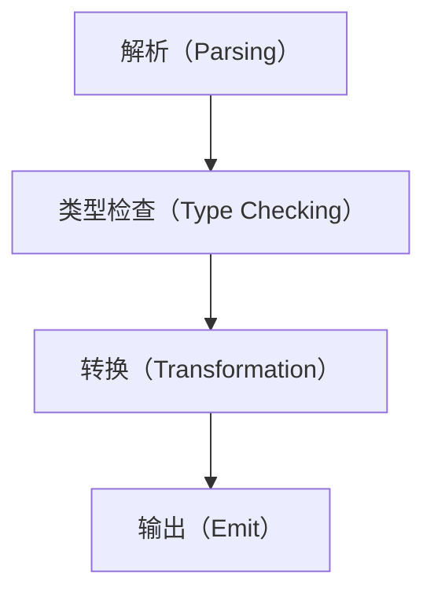

# 面向面试的TypeScript核心知识体系（优化版）
以「对比记忆」为核心（如TS vs JS、interface vs type、any vs unknown），从「实际使用方法」深入到「底层编译/类型检查原理」，新增**场景化实战考点、进阶类型操作、面试避坑点**，适配初级→中高级前端面试需求。

## 一、TS vs JS 核心差异总览（快速抓重点）
TypeScript的核心是「为JavaScript添加静态类型系统」，所有特性均围绕「编译时类型检查」展开，这是与JS最本质的区别。

| 核心维度     | JavaScript（动态类型）           | TypeScript（静态类型）            | 面试考察重点                       |
| ------------ | -------------------------------- | --------------------------------- | ---------------------------------- |
| 类型检查时机 | 运行时（执行代码才发现类型错误） | 编译时（编译为JS前检查类型）      | 类型系统的价值、编译时vs运行时     |
| 类型灵活性   | 弱类型，变量类型可随意修改       | 强类型，类型不匹配编译报错        | 静态类型的优势（早发现错误、提示） |
| 语言特性     | 无接口/泛型/枚举等类型特性       | 扩展接口、泛型、枚举、工具类型    | 核心类型特性的使用与原理           |
| 编译产物     | 无需编译，直接运行               | 编译为JS后运行（类型信息消失）    | 编译原理、tsconfig配置             |
| 工程化支持   | 弱（无类型提示，重构风险高）     | 强（类型提示、重构安全、TSC校验） | 类型守卫、工具类型的实际应用       |

### 核心价值（面试必答）
1. **早发现错误**：编译时暴露类型问题，避免线上运行时错误；
2. **提升开发效率**：编辑器智能提示、代码补全；
3. **增强可维护性**：类型即文档，重构更安全；
4. **兼容JS生态**：TS是JS的超集，所有JS代码可直接作为TS代码运行。

---

## 二、基础类型（面试高频：使用+对比+原理+场景）
TS的基础类型是对JS原始类型的「静态封装」，核心考点是「类型标注、any vs unknown、void vs never」，新增**实战场景适配**。

### 1. 使用层面：基础类型标注+场景化扩展（面试手写）
```typescript
// 1. 原始类型（与JS一一对应，编译后消失）
const name: string = "张三"; 
const age: number = 20; 
const isAdult: boolean = true; 
const nullVal: null = null; 
const undefinedVal: undefined = undefined; 
const symbolVal: symbol = Symbol("id"); 
const bigintVal: bigint = 100n; 

// 2. 任意类型（any）：放弃类型检查，TS退化为JS
let anyVal: any = "hello";
anyVal = 100; 
anyVal.foo(); // 无报错（编译时不检查，运行时可能报错）

// 3. 未知类型（unknown）：安全的any，必须类型守卫才能使用
let unknownVal: unknown = "hello";
unknownVal = 100; 
if (typeof unknownVal === "string") {
  console.log(unknownVal.length); // 类型守卫后，TS推导为string
}

// 4. 无返回值（void）：函数无return或return undefined
function logMsg(): void {
  console.log("hello");
}

// 5. 永真类型（never）：永不存在的值（面试必考）
function throwError(): never {
  throw new Error("出错了");
}
function infiniteLoop(): never {
  while (true) {}
}
type Fruit = "apple" | "banana";
function handleFruit(fruit: Fruit): void {
  switch (fruit) {
    case "apple": break;
    case "banana": break;
    default:
      const _exhaustiveCheck: never = fruit; // 穷尽检查
      throw new Error(`未知水果：${_exhaustiveCheck}`);
  }
}

// 【新增】6. 异步场景的TS标注（面试高频）
// Promise泛型：明确异步返回值类型
const fetchUser: Promise<{ name: string; age: number }> = Promise.resolve({ name: "张三", age: 20 });
// async函数：自动推导返回值为Promise
async function getUser(): Promise<{ name: string }> {
  return await fetchUser.then(res => ({ name: res.name }));
}

// 【新增】7. 可选链+空值合并+TS（实战常用）
type User = { info?: { name?: string }; age?: number };
const user: User = {};
const userName = user?.info?.name; // 推导为 string | undefined
const userAge = user.age ?? 18; // 空值合并，类型仍为 number | undefined
```

### 2. 原理层面：核心对比+面试避坑
#### （1）any vs unknown（面试必考对比+避坑）
| 特性       | any                    | unknown                       | 面试避坑点                          |
| ---------- | ---------------------- | ----------------------------- | ----------------------------------- |
| 类型检查   | 完全关闭               | 编译时检查，需类型守卫        | 避免滥用any，优先用unknown接收未知值 |
| 赋值规则   | 可赋值给任意类型       | 仅可赋值给unknown/any         | unknown赋值给其他类型需先做类型断言 |
| 操作自由度 | 任意操作（无报错）     | 无类型守卫时无法操作          | unknown直接操作会编译报错，需先判断 |
| 安全性     | 低（易引发运行时错误） | 高（编译时拦截错误）          | 老旧JS代码用any兼容，新逻辑用unknown |
| 使用场景   | 兼容老旧JS代码         | 接收未知类型的值（如API返回） | -                                   |

**原理**：
- `any` 会「绕过TS的类型检查器」，编译器对`any`类型的变量不做任何校验；
- `unknown` 是TS的「顶级类型」，仅能赋值给`unknown`/`any`，操作前必须缩小类型范围。

#### （2）void vs never（面试高频对比+避坑）
| 特性     | void                      | never                       | 面试避坑点                          |
| -------- | ------------------------- | --------------------------- | ----------------------------------- |
| 含义     | 无返回值（返回undefined） | 永不存在的值                | never可赋值给任意类型，void仅能赋值给void/any |
| 赋值规则 | 仅可赋值给void/any        | 可赋值给任意类型（底类型）  | 不要用void表示“永远不返回”，用never |
| 函数场景 | 正常结束但无返回值        | 函数永不结束（报错/死循环） | 穷尽检查必须用never，否则无法拦截新增类型 |

**原理**：
- `void` 是「无有效返回值」，函数执行完成但未返回有意义的值；
- `never` 是TS的「底类型」，表示「不可能出现的类型」，常用于穷尽检查、错误处理。

#### （3）TS类型系统的本质（面试进阶）
- TS的类型检查仅发生在**编译阶段**，运行时无任何类型信息（类型标注、接口、泛型等都会被编译移除）；
- 例如：`const name: string = "张三"` 编译后为 `const name = "张三"`，类型标注完全消失；

### 3. 【新增】实战场景：兼容老旧JS代码（面试高频提问）
```typescript
// 场景1：声明无类型的JS模块（declare）
declare module "old-js-lib" {
  export function getInfo(): any; // 临时兼容，优先用unknown
}
// 场景2：@ts-ignore vs @ts-expect-error（面试避坑）
// @ts-ignore：忽略单行所有错误（滥用风险高）
// @ts-expect-error：要求当前行必须有错误，无错误则编译报错（推荐）
// @ts-expect-error: 兼容老旧API返回值类型不匹配
const oldApiRes: string = (window as any).oldApi();
```

---

## 三、复杂类型（面试必考：使用+原理+对比+进阶）
复杂类型是TS面试的核心，重点考察「接口vs类型别名、泛型、枚举」，新增**进阶类型操作、面试避坑**。

### 1. 接口（interface）：定义对象/函数类型（面试高频+避坑）
```typescript
// 1. 定义对象类型
interface User {
  name: string; // 必选属性
  age?: number; // 可选属性
  readonly id: number; // 只读属性（编译时检查，运行时可通过解构修改）
  sayHi: () => void; 
  [key: string]: string | number | boolean | (() => void); // 索引签名
}
const user: User = { name: "张三", id: 1, sayHi: () => console.log("hi") };

// 2. 接口扩展（extends）：继承其他接口
interface Student extends User {
  grade: number; 
}

// 3. 接口合并：同名接口自动合并（面试进阶）
interface Config { host: string; }
interface Config { port: number; }
const config: Config = { host: "localhost", port: 8080 };

// 4. 定义函数类型
interface AddFunc { (a: number, b: number): number; }
const add: AddFunc = (x, y) => x + y;
```
**面试避坑点**：
- 不要用interface定义联合/交叉类型（无此能力）；
- 接口合并时若属性类型冲突（如`Config`同时定义`host: string`和`host: number`），会编译报错；
- 只读属性仅编译时生效，运行时可通过`user.id = 2`（解构/赋值）修改，需在业务层做校验。

### 2. 类型别名（type）：定义任意类型（面试必考+避坑）
```typescript
// 1. 基础用法：基础类型/联合/交叉/元组
type Name = string;
type Status = "success" | "error" | "loading";
type A = { a: number };
type B = { b: string };
type C = A & B;
type Point = [number, number]; // 元组
const point: Point = [10, 20];
point.push(30); // 面试易错：元组允许push（TS设计缺陷）

// 2. 工具类型基础：计算属性
type PartialUser<T> = { [K in keyof T]?: T[K] };
type User = { name: string; age: number };
type UserPartial = PartialUser<User>;
```
**面试避坑点**：
- 同名type会编译报错，无法像interface一样自动合并；
- 定义需频繁扩展的对象结构优先用interface，定义联合/交叉/元组优先用type；
- 元组虽允许push，但访问`point[2]`会编译报错，需注意边界。

#### 接口（interface）vs 类型别名（type）（面试必考对比+结论）
| 特性     | interface              | type                             | 面试结论                          |
| -------- | ---------------------- | -------------------------------- | --------------------------------- |
| 定义范围 | 仅能定义对象/函数类型  | 可定义任意类型（基础/联合/交叉） | 定义API/组件Props用interface      |
| 扩展方式 | extends 关键字         | 交叉类型（&）                    | 扩展对象用interface extends更清晰 |
| 合并规则 | 同名接口自动合并       | 同名类型别名编译报错             | 需合并结构用interface             |
| 计算属性 | 不支持                 | 支持（如[K in keyof T]）         | 工具类型/动态类型用type           |
| 声明提升 | 支持（可先使用后定义） | 不支持（必须先定义后使用）       | 避免type前置定义导致的代码冗余    |

### 3. 泛型：参数化类型（面试必考+进阶）
#### （1）基础用法：函数/接口/类/约束
```typescript
// 1. 泛型函数
function identity<T>(arg: T): T { return arg; }
const str = identity<string>("hello");

// 2. 泛型接口
interface Result<T> { code: number; data: T; }
type UserResult = Result<User>;

// 3. 泛型类
class Stack<T> {
  private items: T[] = [];
  push(item: T) { this.items.push(item); }
  pop(): T | undefined { return this.items.pop(); }
}

// 4. 泛型约束：限制泛型范围（面试高频）
function getProp<T, K extends keyof T>(obj: T, key: K): T[K] {
  return obj[key];
}
const user = { name: "张三", age: 20 };
getProp(user, "name"); // 正确
// getProp(user, "gender"); // 编译报错
```
**面试避坑点**：
- 泛型约束不要过度宽松（如`T extends object`不如`T extends Record<string, any>`精准）；
- 泛型默认值（`Request<T = any>`）仅省略时生效，显式传`any`需写`Request<any>`。

#### （2）【新增】进阶泛型操作（中高级面试必考）
```typescript
// 1. 条件类型 + infer（手写ReturnType/Parameters）
type MyReturnType<T> = T extends (...args: any[]) => infer R ? R : never;
type MyParameters<T> = T extends (...args: infer P) => any ? P : never;
// 示例：获取函数返回值/参数类型
type Func = (a: number, b: string) => boolean;
type FuncReturn = MyReturnType<Func>; // boolean
type FuncParams = MyParameters<Func>; // [number, string]

// 2. 映射类型重映射（TS4.1+）
// 场景：给属性名加前缀，同时转为可选
type PrefixOptional<T, Prefix extends string> = {
  [K in keyof T as `${Prefix}${Capitalize<string & K>}`]?: T[K];
};
type PrefixUser = PrefixOptional<User, "new">; // { newName?: string; newAge?: number }
```

### 4. 枚举（enum）：定义命名常量（面试高频+避坑）
```typescript
// 1. 数值枚举（默认从0开始递增，可手动指定值）
enum Direction { Up, Down, Left = 10, Right }
console.log(Direction.Up); // 0
console.log(Direction[0]); // "Up"（反向映射，仅数值枚举支持）

// 2. 字符串枚举（无反向映射，必须手动指定值）
enum Status { Success = "success", Error = "error" }

// 3. 常量枚举（const enum）：编译优化，无反向映射
const enum Color { Red, Green }
const color = Color.Red; // 编译为：const color = 0;
```
**面试避坑点**：
- 普通数值枚举易因反向映射导致代码冗余，优先用`const enum`或「字面量联合类型」（`type Status = "success" | "error"`）；
- 字符串枚举无反向映射，`Status["success"]`会编译报错，避免误写；
- 枚举编译后生成真实对象（除const enum），运行时存在，需考虑体积。

---

## 四、高级特性（面试进阶：使用+原理+工程化）
### 1. 类型断言：告诉编译器类型（非类型转换）
```typescript
const str1 = <string>unknownVal; // JSX中冲突，推荐用as
const str2 = unknownVal as string;

// 原理：类型断言仅编译时生效，运行时无任何转换逻辑
const num = 100 as unknown as string; // 双重断言（需先断言为unknown）
console.log(num.length); // 运行时报错：number没有length属性
```
**面试避坑点**：
- 类型断言≠类型转换，仅欺骗编译器，运行时类型不变；
- 避免滥用双重断言，优先用类型守卫缩小范围。

### 2. 类型守卫：缩小类型范围（面试高频+自定义）
```typescript
// 1. 基础守卫：typeof/instanceof/in
function handleValue(val: string | number) {
  if (typeof val === "string") console.log(val.length);
}
class Animal {}
class Dog extends Animal { bark() {} }
function handleAnimal(animal: Animal) {
  if (animal instanceof Dog) animal.bark();
}

// 2. 自定义类型守卫（面试进阶）
type Cat = { name: string; meow: () => void };
type Dog = { name: string; bark: () => void };
function isCat(pet: Cat | Dog): pet is Cat {
  return (pet as Cat).meow !== undefined;
}
if (isCat(pet)) pet.meow();
```

### 3. 工具类型：内置+手写（面试必考）
#### （1）核心工具类型使用示例
```typescript
type User = { name: string; age: number };
type PartialUser = Partial<User>; // 所有属性可选
type RequiredUser = Required<PartialUser>; // 所有属性必选
type ReadonlyUser = Readonly<User>; // 所有属性只读
type PickUser = Pick<User, "name">; // 挑选name属性
type OmitUser = Omit<User, "age">; // 排除age属性
type RecordUser = Record<string, User>; // 键为string，值为User
```

#### （2）手写核心工具类型（面试必考+思路）
```typescript
// 手写思路：先明确“类型操作逻辑”，再写代码
// 1. Partial<T>：遍历属性，加可选标记
type MyPartial<T> = { [K in keyof T]?: T[K]; };

// 2. Required<T>：遍历属性，移除可选标记
type MyRequired<T> = { [K in keyof T]-?: T[K]; };

// 3. Readonly<T>：遍历属性，加只读标记
type MyReadonly<T> = { readonly [K in keyof T]: T[K]; };

// 4. Pick<T, K>：挑选指定属性
type MyPick<T, K extends keyof T> = { [P in K]: T[P]; };

// 5. Omit<T, K>：先排除属性名，再挑选（Pick + Exclude）
type MyExclude<T, U> = T extends U ? never : T;
type MyOmit<T, K extends keyof T> = MyPick<T, MyExclude<keyof T, K>>;

// 6. Record<K, T>：定义键值对类型
type MyRecord<K extends keyof any, T> = { [P in K]: T; };
```

#### （3）【新增】模块扩展（Module Augmentation）（工程化高频）
```typescript
// 场景：扩展axios的请求配置类型（面试高频）
declare module "axios" {
  interface AxiosRequestConfig {
    timeout?: number;
    customHeader?: string; // 新增自定义属性
  }
}
```

---

## 五、编译配置（tsconfig.json）：面试高频+提问适配
`tsconfig.json`是TS项目的核心配置文件，补充**面试高频提问+坑点**。

### 1. 核心配置项（使用+面试考点）
```json
{
  "compilerOptions": {
    "target": "ES6", // 编译目标JS版本
    "module": "ESNext", // 模块系统
    "moduleResolution": "Node", // 模块解析策略
    "outDir": "./dist", // 编译输出目录
    "rootDir": "./src", // 源码根目录
    "strict": true, // 开启所有严格检查（面试必考，推荐开启）
    "strictNullChecks": true, // 严格null检查
    "esModuleInterop": true, // 兼容ES模块和CommonJS模块
    "declaration": true, // 生成.d.ts类型声明文件
    "skipLibCheck": true, // 跳过第三方库的类型检查
    "noImplicitAny": true, // 禁止隐式any类型
    "resolveJsonModule": true // 支持导入JSON文件
  },
  "include": ["./src/**/*"], 
  "exclude": ["./node_modules"] 
}
```

### 2. 【新增】面试高频提问+坑点
| 配置项         | 核心作用                          | 面试高频提问/坑点                                                                 |
|----------------|-----------------------------------|----------------------------------------------------------------------------------|
| target + module | 指定编译目标和模块系统            | 提问：“target=ES6、module=CommonJS的兼容性？”<br>答：生成ES6语法+CommonJS模块，Node.js兼容，浏览器需打包工具处理 |
| strict         | 开启所有严格检查                  | 提问：“strict包含哪些核心配置？”<br>答：strictNullChecks、noImplicitAny、strictFunctionTypes等，开启后最大程度保证类型安全 |
| esModuleInterop | 兼容ES和CommonJS模块              | 坑点：关闭时导入CommonJS模块需写`import * as React from "react"`，开启后可写`import React from "react"` |
| declaration    | 生成.d.ts文件                     | 坑点：rootDir配置错误会导致d.ts文件路径错乱，需保证rootDir指向源码根目录           |
| skipLibCheck   | 跳过第三方库类型检查              | 坑点：开启后可能忽略第三方库的类型错误，需在核心依赖校验完成后开启                |

---

## 六、TS编译原理（面试进阶）
TS编译为JS的核心流程（4步）：

1. **解析**：将TS源码解析为「抽象语法树（AST）」（词法分析→语法分析）；
2. **类型检查**：遍历AST，校验类型是否合法（核心阶段，TS的核心价值）；
3. **转换**：将AST转换为目标版本的JS AST（如ES6→ES5）；
4. **输出**：将JS AST生成JS代码，可选生成source map、d.ts文件。

**核心结论**：TS的类型系统仅在「类型检查」阶段生效，转换/输出阶段会完全移除类型信息，最终运行的是纯JS代码。

---

## 七、【新增】面试易错点总结（速记）
1. 元组允许`push`（TS设计缺陷）：`Point = [number, number]` 可`push(3)`，但访问`point[2]`编译报错；
2. 类型断言≠类型转换：`100 as unknown as string`编译后仍是`100`，运行时访问`length`报错；
3. never是“底类型”：可赋值给任意类型，void仅可赋值给void/any；
4. strictNullChecks：开启后`string`不能赋值为`null/undefined`，需显式写`string | null`；
5. 枚举反向映射仅数值枚举支持：字符串枚举无`Status["success"]`，避免误写；
6. interface合并冲突：同名接口属性类型冲突会编译报错，需提前规划结构。

---

## 八、总结：面试核心记忆点（优化版）
### 1. 核心原理（必背）
- TS是JS的超集，类型检查仅在编译阶段，运行时无类型信息；
- 泛型是编译时的类型参数，最终会被擦除；
- 接口仅编译时约束结构，无运行时代码生成；
- `strict: true` 是TS最核心的配置，开启后能最大程度发挥类型检查价值。

### 2. 高频面试题（带场景化应答）
- Q：interface和type的区别？
  A：① interface仅定义对象/函数类型，type可定义任意类型；② interface支持extends和自动合并，type不支持合并；③ 定义API/组件Props用interface，定义联合/交叉类型用type。
- Q：any和unknown的区别？
  A：① any完全关闭类型检查，unknown是安全的any；② unknown需类型守卫才能操作，仅可赋值给unknown/any；③ 老旧JS代码用any兼容，新逻辑优先用unknown。
- Q：泛型的作用？
  A：① 代码复用：一套逻辑适配多种类型；② 类型安全：避免any；③ 动态类型：如泛型接口适配不同API返回值。
- Q：TS项目中如何引入无类型的老旧JS库？
  A：① 用declare声明模块（`declare module "old-lib"`）；② 临时用any兼容；③ 编写.d.ts类型声明文件。
- Q：TS的编译流程？
  A：解析（生成AST）→ 类型检查 → 转换（转为目标JS）→ 输出（生成JS代码）。
  
[TS 面试](./ts.md)  
