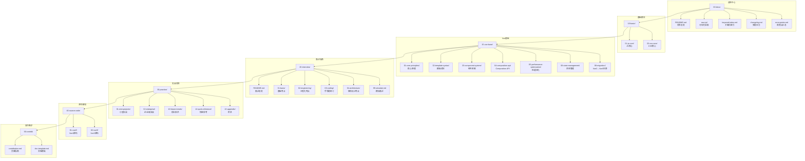
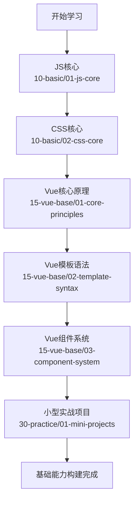
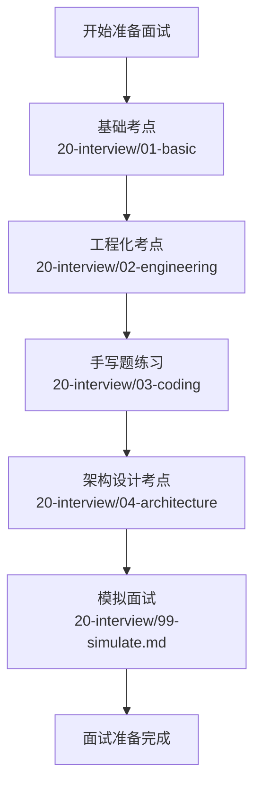
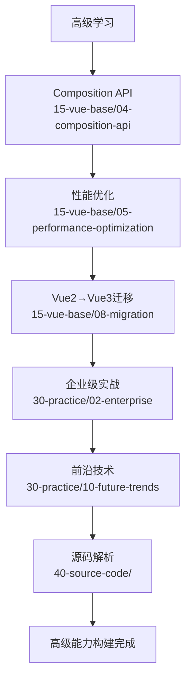

# 可视化导航

## 整体架构流程图

## 模块跳转导航

### 总控中心
- [项目总览](README.md)
- [可视化导航](nav.md)
- [关键词索引](keyword-index.md)
- [变更日志](changelog.md)
- [高频易错点](error-points.md)

### 基础模块
- [JS核心](../10-basic/01-js-core/README.md)
- [CSS核心](../10-basic/02-css-core/README.md)

### Vue基础
- [核心原理](../15-vue-base/01-core-principles/README.md)
- [模板语法](../15-vue-base/02-template-syntax/README.md)
- [组件系统](../15-vue-base/03-component-system/README.md)
- [Composition API](../15-vue-base/04-composition-api/README.md)
- [性能优化](../15-vue-base/05-performance-optimization/README.md)
- [状态管理](../15-vue-base/06-state-management/README.md)
- [Vue2→Vue3迁移](../15-vue-base/08-migration/README.md)

### 面试指南
- [面试总览](../20-interview/README.md)
- [基础考点](../20-interview/01-basic/README.md)
- [工程化考点](../20-interview/02-engineering/README.md)
- [手写题练习](../20-interview/03-coding/README.md)
- [架构设计考点](../20-interview/04-architecture/README.md)
- [模拟面试](../20-interview/99-simulate.md)

### 实战项目
- [小型实战](../30-practice/01-mini-projects/README.md)
- [企业级实战](../30-practice/02-enterprise/README.md)
- [前沿技术](../30-practice/10-future-trends/README.md)
- [快速参考](../30-practice/12-quick-reference/README.md)
- [附录](../30-practice/13-appendix/README.md)

### 源码解析
- [Vue2源码](../40-source-code/01-vue2/README.md)
- [Vue3源码](../40-source-code/02-vue3/README.md)

### 协作维护
- [贡献指南](../90-contrib/contribution.md)
- [文档模板](../90-contrib/doc-template.md)

## 学习路径导航

### 初学者路径

### 面试准备路径

### 高级开发者路径

## 导航说明

### 如何使用本导航

1. **整体架构了解**：通过顶部的整体架构流程图，了解项目的完整结构和模块关系
2. **快速跳转**：使用模块跳转导航中的链接，直接跳转到对应的模块文档
3. **学习路径参考**：根据自身水平选择合适的学习路径，按照流程图中的顺序进行学习
4. **可视化追踪**：通过Mermaid流程图，直观了解学习进度和知识体系构建情况

### 导航更新说明

- **模块新增**：当项目新增模块时，会同步更新本导航文档中的流程图和链接
- **路径调整**：如果模块路径发生变化，会及时更新跳转链接，确保导航的准确性
- **学习路径优化**：根据社区反馈和技术发展，定期优化推荐的学习路径

### 反馈与建议

如果您对导航结构有任何建议或发现链接错误，请通过以下方式反馈：
- **GitHub Issue**：提交导航相关的问题和建议
- **直接PR**：修正错误的链接或优化导航结构
- **讨论区**：在相关模块的讨论区提出导航改进建议

## 快捷键导航

为了方便快速访问核心模块，这里提供了一些常用模块的相对路径：

### 基础模块
- JS核心：`../10-basic/01-js-core/README.md`
- CSS核心：`../10-basic/02-css-core/README.md`

### Vue核心模块
- 核心原理：`../15-vue-base/01-core-principles/README.md`
- 组件系统：`../15-vue-base/03-component-system/README.md`
- Composition API：`../15-vue-base/04-composition-api/README.md`

### 面试与实战
- 面试总览：`../20-interview/README.md`
- 小型实战：`../30-practice/01-mini-projects/README.md`

### 源码解析
- Vue2源码：`../40-source-code/01-vue2/README.md`
- Vue3源码：`../40-source-code/02-vue3/README.md`

通过本导航文档，您可以快速了解项目结构，找到感兴趣的模块，并按照推荐的学习路径进行系统性学习。